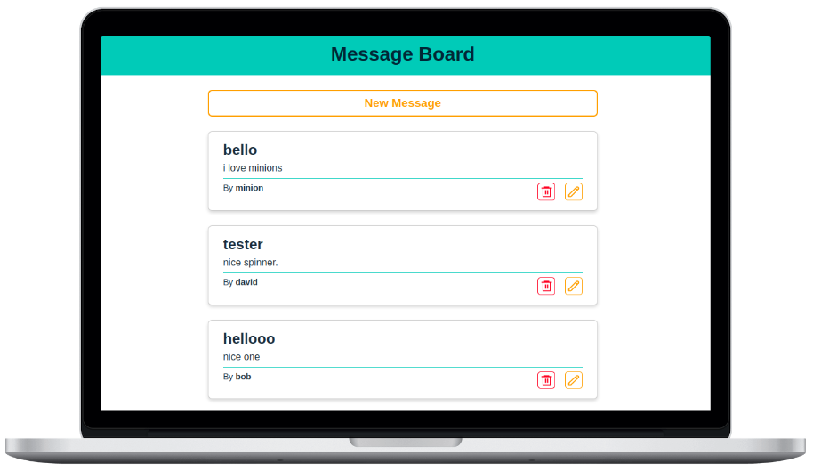

# Message Board

It is a full-stack web app where everyone can post new messages and see messages written by others. I created this project mainly to practice the MERN stack.

:point_right: **See it live [here](https://message-board-top.netlify.app/)**

## Features

- User can create, read, update, and delete messages.
- Fully responsive design.
- Pagination to load more messages.

## Technologies Used

- [React](https://reactjs.org/)
- [NodeJS](https://nodejs.org/)
- [ExpressJS](https://expressjs.com/)
- [MongoDB](https://www.mongodb.com/)
- [Mongoose](https://mongoosejs.com/)
